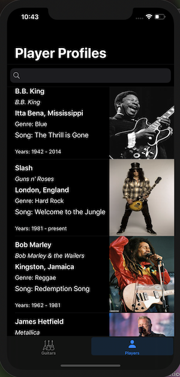

# GuitarsApp
An app that will help guitarists identify the gear they need.
This app helps you build your rig from the ground up or you can use an artist's rig to model yours!
The app that helps you find your sound.

## Code snippet of the most challenging part of this project
var selectedPedal = Pedal(brand: "Boss", name: "Blues Driver", fx: "Overdrive", price: 79.99, picture: "Boss Blues Driver"){
        
        didSet{
            for (index, pedal) in pedalBoards.enumerated() {
                if pedal.isEmpty {
                    
                    // add pedal image to available slot
                    
                    imageViews[index].image = UIImage(named:selectedPedal.picture)
                    
                    pedalBoards[index].image = UIImage(named:selectedPedal.picture)
                    pedalBoards[index].isEmpty = false
                    pedalBoards[index].index = index
                    break
                }
            }
        }
    }

# ScreenshotOfTheApp

## GIFOfTheApp

